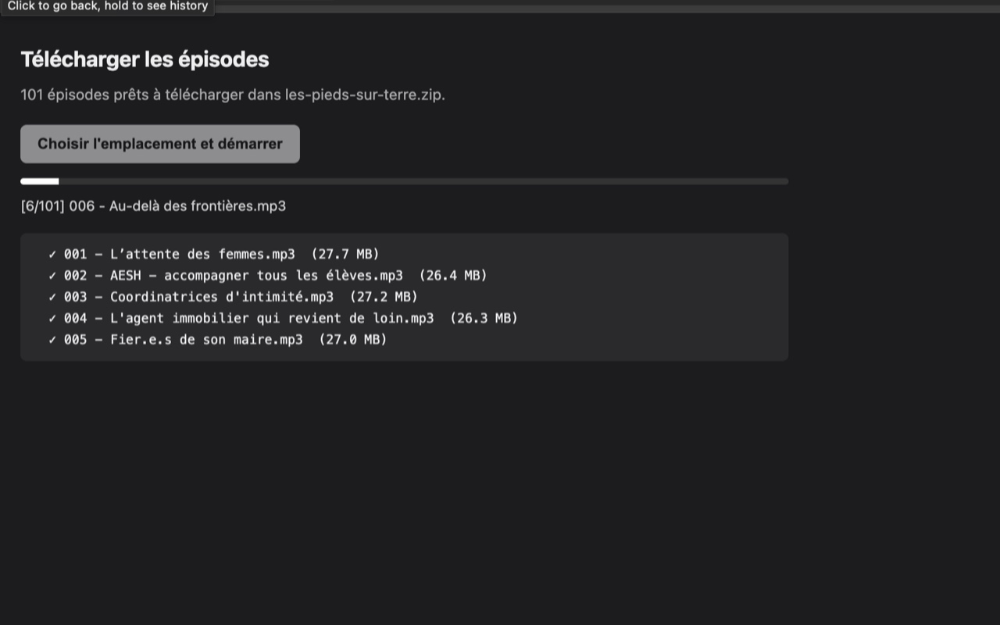

# Radio Podcast Downloader

[](LICENSE)
[](chrome-extension/manifest.json)
[](https://rilax117.github.io/radio-podcast-downloader/PRIVACY)

🇫🇷 Français · [🇬🇧 English version](#english-version)

> Télécharger en lot tous les épisodes d'un podcast [radio-podcast.fr](https://radio-podcast.fr) dans **un seul fichier `.zip`**.

Trois outils interchangeables :

- 🌐 **Extension Chrome** — un bouton sur la page, un prompt « où enregistrer », un `.zip`.
- 🐍 **Script Python** — `python3 scripts/download_episodes.py`, aucune dépendance externe.
- 🐚 **Script Bash + curl** — `./scripts/download_episodes.sh`, autonome.



---

## Pourquoi ?

Le site [radio-podcast.fr](https://radio-podcast.fr) liste des centaines d'épisodes de podcasts France Culture / France Inter / etc., chacun téléchargeable individuellement. Pour un podcast de 100+ épisodes, c'est 100+ clics et 100+ entrées dans la barre de téléchargements Chrome.

Cet outil fait le travail en une opération : il extrait les URLs depuis le DOM, télécharge tous les mp3, et les empaquète **en streaming** dans une archive ZIP unique avec des noms lisibles `001 - Titre.mp3`.

## Installation

### Extension Chrome

> ⏳ La publication sur le Chrome Web Store est en cours de soumission.

En attendant, install manuelle (mode développeur) :

1. Cloner ce repo ou télécharger le [dernier ZIP](https://github.com/rilax117/radio-podcast-downloader/archive/refs/heads/main.zip) et le décompresser.
2. Ouvrir `chrome://extensions/`.
3. Activer le **Mode développeur** (toggle en haut à droite).
4. Cliquer **« Charger l'extension non empaquetée »** → sélectionner le dossier [`chrome-extension/`](chrome-extension/).

### Scripts Python / Bash

Rien à installer — les deux scripts utilisent uniquement des outils préinstallés sur macOS (Python 3, Bash, curl, perl).

## Usage

### Extension Chrome

L'extension s'active sur **toute** page `radio-podcast.fr/podcast/*` (pas seulement Les Pieds sur Terre — fonctionne pour n'importe quelle série).

1. Ouvrir la page d'index d'un podcast.
2. Cliquer **« Télécharger tous les épisodes »** (panneau flottant en haut à droite, ou icône popup dans la toolbar).
3. Un nouvel onglet s'ouvre → cliquer **« Choisir l'emplacement et démarrer »**.
4. Sélectionner où enregistrer le `.zip` → l'archive se construit en streaming.

Tu obtiens **un seul fichier** `nom-du-podcast.zip` contenant tous les mp3 nommés `NNN - Titre.mp3`.

### Script Python

```bash
python3 scripts/download_episodes.py                       # auto-trouve le HTML local
python3 scripts/download_episodes.py path/vers/page.html   # ou chemin explicite
```

Le script cherche un fichier HTML dans `./` ou `./_archives/` (à toi de l'enregistrer depuis le navigateur), extrait les épisodes, et télécharge tout dans `./mp3/`. Idempotent.

### Script Bash + curl

```bash
./scripts/download_episodes.sh                              # re-fetch depuis radio-podcast.fr
./scripts/download_episodes.sh chemin/vers/page.html        # parse un fichier local
./scripts/download_episodes.sh -o ./autre-dossier           # destination custom
```

## Comment ça marche

### Streaming dans un seul ZIP (extension)

L'extension fetche chaque mp3 et pipe les octets directement dans un fichier `.zip` choisi par l'utilisateur via [`showSaveFilePicker`](https://developer.mozilla.org/en-US/docs/Web/API/Window/showSaveFilePicker), à travers un [writer ZIP maison](chrome-extension/zip-writer.js) (mode STORE, *data descriptors*).

L'utilisation mémoire reste bornée : aucun fichier n'est jamais bufferisé entièrement en RAM, même pour une archive de plusieurs Go.

### Convention de nommage

`NNN - Titre.mp3` :

- Numéro paddé sur 3 chiffres
- Caractères OS-unsafe remplacés : `/` → `-` ; `:` → ` -`
- Entités HTML décodées (`&nbsp;`, `&amp;`, `&#39;`, …)
- Apostrophes courbes et accents préservés

### Architecture extension

| Fichier | Rôle |
|---|---|
| [`content.js`](chrome-extension/content.js) | Injecté sur les pages `radio-podcast.fr/podcast/*` ; bouton flottant + extraction DOM des `data-mp3` |
| [`popup.js`](chrome-extension/popup.js) | UI alternative via l'icône toolbar |
| [`background.js`](chrome-extension/background.js) | Service worker, ouvre l'onglet de téléchargement avec la liste d'épisodes |
| [`downloader.html`](chrome-extension/downloader.html) + [`downloader.js`](chrome-extension/downloader.js) | Page dédiée qui fetch + stream le ZIP via `showSaveFilePicker` |
| [`zip-writer.js`](chrome-extension/zip-writer.js) | Writer ZIP maison (STORE, data descriptors, UTF-8) |

## Développement

### Builder l'extension

```bash
./scripts/build-extension.sh
```

Produit dans `dist/` :
- `extension-webstore.zip` — à uploader sur le Chrome Web Store
- `extension.crx` — version signée pour distribution privée (requiert une `chrome-extension.pem` locale)

### Layout du projet

```
.
├── README.md                  # Ce fichier
├── LICENSE                    # MIT
├── PRIVACY.md                 # Politique de confidentialité (Web Store)
├── chrome-extension/          # Sources de l'extension (MV3)
├── scripts/
│   ├── build-extension.sh     # Build des artefacts dans dist/
│   ├── download_episodes.py   # Script Python
│   └── download_episodes.sh   # Script Bash + curl
└── store-assets/              # Icône + screenshots pour la fiche Web Store
```

## Confidentialité

L'extension ne collecte, ne stocke et ne transmet aucune donnée personnelle. Voir [PRIVACY.md](PRIVACY.md) ou la version publiée : https://rilax117.github.io/radio-podcast-downloader/PRIVACY

## Licence

[MIT](LICENSE) © 2026 rilax117

---

<a id="english-version"></a>

# Radio Podcast Downloader

🇬🇧 English · [🇫🇷 Version française](#radio-podcast-downloader)

> Bulk-download every episode of a [radio-podcast.fr](https://radio-podcast.fr) podcast into **a single `.zip` file**.

Three interchangeable tools:

- 🌐 **Chrome extension** — one button on the page, one "where to save" prompt, one `.zip`.
- 🐍 **Python script** — `python3 scripts/download_episodes.py`, zero external dependencies.
- 🐚 **Bash + curl script** — `./scripts/download_episodes.sh`, self-contained.


## Why?

The site [radio-podcast.fr](https://radio-podcast.fr) lists hundreds of episodes per podcast (France Culture, France Inter, etc.), each downloadable individually. For a 100+ episode series, that's 100+ clicks and 100+ entries in Chrome's downloads bar.

This tool does the job in a single operation: it extracts URLs from the DOM, downloads every mp3, and packs them **as a stream** into a single ZIP archive with readable filenames like `001 - Title.mp3`.

## Installation

### Chrome extension

> ⏳ Chrome Web Store publication is pending review.

In the meantime, manual install (developer mode):

1. Clone this repo or download the [latest ZIP](https://github.com/rilax117/radio-podcast-downloader/archive/refs/heads/main.zip) and extract it.
2. Open `chrome://extensions/`.
3. Enable **Developer mode** (toggle, top right).
4. Click **"Load unpacked"** → select the [`chrome-extension/`](chrome-extension/) directory.

### Python / Bash scripts

Nothing to install — both scripts only use tools preinstalled on macOS (Python 3, Bash, curl, perl).

## Usage

### Chrome extension

The extension activates on **any** `radio-podcast.fr/podcast/*` page (not just *Les Pieds sur Terre* — works for any series on the site).

1. Open a podcast's index page.
2. Click **"Télécharger tous les épisodes"** (floating panel top-right, or popup icon in the toolbar).
3. A new tab opens → click **"Choisir l'emplacement et démarrer"**.
4. Pick where to save the `.zip` → the archive is built as a stream.

You get **a single file** `podcast-name.zip` containing all the mp3s named `NNN - Title.mp3`.

### Python script

```bash
python3 scripts/download_episodes.py                       # auto-finds local HTML
python3 scripts/download_episodes.py path/to/page.html     # or explicit path
```

The script looks for an HTML file in `./` or `./_archives/` (saved from the browser by you), extracts the episodes, and downloads everything into `./mp3/`. Idempotent.

### Bash + curl script

```bash
./scripts/download_episodes.sh                              # re-fetch from radio-podcast.fr
./scripts/download_episodes.sh path/to/page.html            # parse a local file
./scripts/download_episodes.sh -o ./other-folder            # custom output dir
```

## How it works

### Single-ZIP streaming (extension)

The extension fetches each mp3 and pipes the bytes directly into a `.zip` file the user chose via [`showSaveFilePicker`](https://developer.mozilla.org/en-US/docs/Web/API/Window/showSaveFilePicker), through a [hand-rolled ZIP writer](chrome-extension/zip-writer.js) (STORE mode, *data descriptors*).

Memory usage stays bounded: no file is ever fully buffered in RAM, even for multi-GB archives.

### Filename convention

`NNN - Title.mp3`:

- Number zero-padded to 3 digits
- OS-unsafe characters replaced: `/` → `-` ; `:` → ` -`
- HTML entities decoded (`&nbsp;`, `&amp;`, `&#39;`, …)
- Curly apostrophes and accents preserved

### Extension architecture

| File | Role |
|---|---|
| [`content.js`](chrome-extension/content.js) | Injected on `radio-podcast.fr/podcast/*` pages; floating button + DOM extraction of `data-mp3` |
| [`popup.js`](chrome-extension/popup.js) | Alternative UI via the toolbar icon |
| [`background.js`](chrome-extension/background.js) | Service worker, opens the download tab with the episode list |
| [`downloader.html`](chrome-extension/downloader.html) + [`downloader.js`](chrome-extension/downloader.js) | Dedicated page that fetches + streams the ZIP via `showSaveFilePicker` |
| [`zip-writer.js`](chrome-extension/zip-writer.js) | Hand-rolled ZIP writer (STORE, data descriptors, UTF-8) |

## Development

### Build the extension

```bash
./scripts/build-extension.sh
```

Produces in `dist/`:
- `extension-webstore.zip` — to upload to the Chrome Web Store
- `extension.crx` — signed version for private distribution (requires a local `chrome-extension.pem`)

### Project layout

```
.
├── README.md                  # This file
├── LICENSE                    # MIT
├── PRIVACY.md                 # Privacy policy (Web Store)
├── chrome-extension/          # Extension sources (MV3)
├── scripts/
│   ├── build-extension.sh     # Build artifacts into dist/
│   ├── download_episodes.py   # Python script
│   └── download_episodes.sh   # Bash + curl script
└── store-assets/              # Icon + screenshots for the Web Store listing
```

## Privacy

The extension does not collect, store, or transmit any personal data. See [PRIVACY.md](PRIVACY.md) or the published version: https://rilax117.github.io/radio-podcast-downloader/PRIVACY

## License

[MIT](LICENSE) © 2026 rilax117
